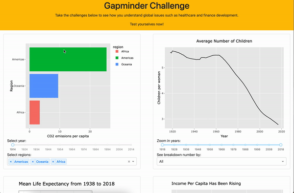

# Gapminder Challenge R App

Link to the app: https://gapminder-challenge-r.herokuapp.com/

## Welcome!

Thank you for visiting the Gapminder Challenge R app project repository!

This document is aimed to give you some information about our project. You can either jump straight to one of the sections below or scroll down to find out more.

* [About this project](#about-this-project)
* [Installation](#installation)
* [Get Involved](#get-involved)
* [License and Contributors](#license-and-contributors)

## About this project

### The App

Our app is hosted on Heroku. Take the challenges [here](https://gapminder-challenge-r.herokuapp.com/) to see how you understand global issues. You will be able to:

* know immediately if your worldview is up-to-date

* see visual plots of the underlying data

* interact with the app by filtering year range, region, and more

Test yourselves now!

### Project Motivation

This project is designed to augment the existing gapminder [worldview upgrader](https://upgrader.gapminder.org/) tool. [Gapminder](https://www.gapminder.org/) is an NGO founded to address systematic misconceptions about global development. Gapminder provides free-to-access data and teaching material on global development based on reliable statistics. Their worldview upgrader involves participants answering questions about various topics linked to [UN development goals](https://sdgs.un.org/goals), and being provided correct answers with accompanying explanations. Our project proposes to augment the experience of the worldview upgrader by providing interactive visualizations along with answers to questions related to UN development goals, leveraging the [Gapminder dataset](https://cran.r-project.org/web/packages/gapminder/README.html). This allows our users to explore and manipulate the data supporting the answers to the questions, providing a dynamic and enriched learning experience.

### Dashboard Description

Our app features a single page that hosts four interactive data visualization plots by a 2 by 2 layout. Each plot is associated with one question that evaluates the users' understanding of global development since 1900s. The topics include child birth rate, child mortality vs. income level, average life expectancy, and income per capita. Each plot has its own controls, such as sliders for year range and drop-down menus for country, region, and income group selections. These components allow the users to explore and manipulate the data supporting the answers to the questions, offering a dynamic and enriched learning experience.

## Get Involved

Our app is still under active development. We'd love your feedback along the way.

Interested in contributing? We can certainly use your expertise in user experience design, data validation, front end development, and documentation. Check out the contributing guidelines. Please note that this project is released with a [Code of Conduct](https://github.com/UBC-MDS/gapminder_challenge-R/blob/main/CONDUCT.md). By contributing to this project, you agree to abide by its terms.

For this project, we used `Dash` for dashboarding, `Altair` and `Plotly` for charts, and `Heroku` for deployment. Do check out the following links to learn more about them:

* [Dash Python User Guide](https://dash.plotly.com/)
* [Dash interactive visualization](https://dash.plotly.com/interactive-graphing)
* [Altair documentation](https://altair-viz.github.io/index.html)
* [Plotly Python documentation](https://plotly.com/python/)
* [Deploying Dash (on Heroku)](https://dash.plotly.com/deployment)

## License and Contributors

`gapminder_challenge` was created by:

* Son Chau

* Julien Gordon

* Irene Yan

* Vanessa Yuen

It is licensed under the terms of the MIT license.